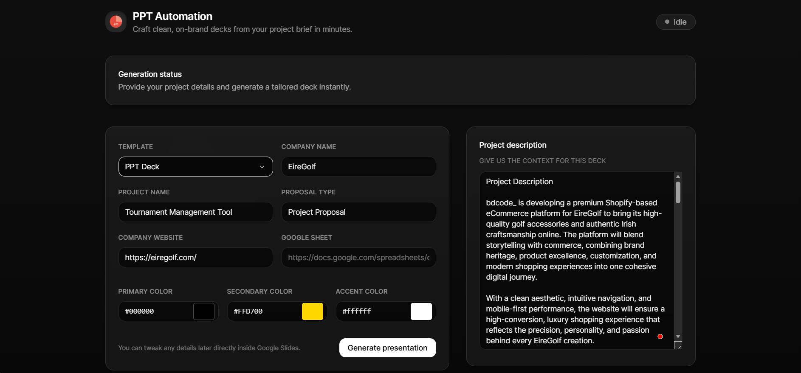

# PPT Automation

**✅ Project Status: Complete & Production Ready**

AI-powered presentation generation with automatic theming and content creation. Fully automated system for generating professional Google Slides presentations with intelligent content, theming, images, and hyperlinks.



## 🚀 Quick Start

### 1. Setup Environment

Create a `.env` file:
```env
AUTH_MODE=oauth
GEMINI_API_KEY=your_gemini_key_here
TEMPLATE_PRESENTATION_ID=your_template_id_here
DEFAULT_IMAGE_URL=https://your-default-image.com/image.jpg
BING_IMAGE_SEARCH_KEY=your_bing_key_here
```

### 2. Install Dependencies

```bash
pip install -r requirements.txt
```

### 3. Run the Application

**🎯 Interactive Mode (Recommended):**
```bash
# Simple interactive mode
python main.py --interactive

# Or use the dedicated launcher
python interactive.py

# Or use the Windows batch file
run_interactive.bat
```

**Company Mode with AI Theme Analysis:**
```bash
python main.py --company "Apple Inc" --template-id YOUR_TEMPLATE_ID
```

**Test Theme Analysis:**
```bash
python test_theme_simple.py
```

## 🎨 AI Theme Analysis

The system now uses Gemini to analyze companies and generate comprehensive themes:

- **Industry Detection**: Automatically identifies the company's industry
- **Brand Personality**: Analyzes brand characteristics (professional, creative, tech, healthcare, etc.)
- **Target Audience**: Determines B2B/B2C/enterprise/startup focus
- **Color Palette**: Generates professional color schemes based on industry and brand
- **Typography**: Selects appropriate fonts and sizes for different content types
- **Visual Hierarchy**: Applies consistent styling across all text elements

### Theme Properties Generated:
- Primary, secondary, and accent colors
- Font family and sizes for titles, subtitles, and body text
- Text styling (bold, normal) based on content hierarchy
- Industry classification and brand personality analysis

## 📁 Project Structure

```
PPT Automation/
├── backend/
│   ├── core/                  # Core functionality
│   │   ├── __init__.py
│   │   ├── automation.py      # Main automation logic
│   │   ├── generator.py       # AI content generation
│   │   └── slides_client.py   # Google Slides API client
│   ├── utils/                 # Utilities (color manager, logging, placeholder tools)
│   ├── config/                # JSON configs (themes, auto-contrast, prompts)
│   ├── templates/             # Template configs/mapping
│   ├── credentials/           # OAuth/service account files
│   ├── server.py              # Backend server (if running API)
│   ├── main.py                # CLI entry points
│   └── requirements.txt       # Python dependencies
├── frontend/
│   ├── src/                   # React + Vite app (TypeScript)
│   ├── index.html
│   ├── package.json           # Scripts: dev, build, preview
│   ├── vite.config.ts
│   ├── tailwind.config.js
│   └── postcss.config.js
├── README.md
└── requirements.txt           # Root (optional)
```

## 🎯 Features

- **🎨 AI Content Generation**: Uses Google Gemini for intelligent content creation
- **🏢 Company Theming**: Automatically generates color themes based on company analysis
- **🖼️ Smart Image System**: 
  - Automatic image generation with exact dimension matching
  - Pre-cropping to precise placeholder sizes (inches/points)
  - Support for 15+ scope images and multiple image types
  - Background image generation from main images
- **📐 Exact Dimension Control**: Manual crop dimensions for pixel-perfect image placement
- **🎯 Deterministic Emoji Selection**: Keyword-based emoji matching for logos (no AI dependency)
- **✨ Text Styling**: Applies theme-based colors and formatting with auto-contrast
- **📊 Token Usage Reporting**:
  - Tracks Gemini prompt/candidate/total tokens per run
  - Logs totals and returns `token_usage` in automation responses
- **🔗 Smart Hyperlink System**: 
  - Automatic URL extraction from project descriptions
  - Support for multiple reference links with unique URLs
  - Google Sheets integration for cost estimates
  - Selective underline styling for reference links
- **🎯 Interactive Mode**: Step-by-step guided interface with multiple presentation types
- **🔍 Auto-detect Mode**: Automatically analyzes templates and fills placeholders
- **⚙️ Custom Options**: Support for custom images, themes, and advanced settings
- **🎨 Logo Positioning**: Exact placeholder positioning with transform preservation

## 📋 Supported Placeholders

### Text Placeholders
- `{{projectName}}` - Project name
- `{{companyName}}` - Company name  
- `{{proposalName}}` - Proposal type
- `{{Heading_1}}` through `{{Heading_6}}` - Section headings
- `{{side_Heading_1}}` through `{{side_Heading_15}}` - Side section headings
- `{{projectOverview}}` - Project overview text
- `{{property1}}`, `{{property2}}`, `{{property3}}` - Feature properties
- `{{bullet_1}}`, `{{bullet_2}}`, `{{bullet_3}}` - Bullet points
- And many more semantic placeholders (see `backend/config/prompts_text.json`)

### Image Placeholders

**Main Images:**
- `{{image_1}}` - Hero image (8.47×10.63 inches, portrait)
- `{{image_2}}` - Supporting image (12.5×4.17 inches, landscape)
- `{{image_3}}` - Impact image (8.33×10.83 inches, portrait)
- `{{backgroundImage}}` - Background image (26.67×15 inches, landscape) - Auto-generated from `image_1`

**Scope Images** (15 placeholders, all 5.75×12.74 inches, portrait):
- `{{scope_img_1}}` through `{{scope_img_15}}` - Conceptual images for project aspects

**Logo Placeholders:**
- `{{logo}}` - Company logo
- `{{companyLogo}}` - Company logo (alternative)
- `{{logo_1}}` through `{{logo_6}}` - Themed logo emojis (deterministic selection)

**Other Image Types:**
- `{{chart_1}}` - Data visualization chart (dynamic dimensions)
- `{{d_i_image_1}}`, `{{d_i_image_2}}` - Design/inspiration images (dynamic dimensions)

### Hyperlink Placeholders

**Reference Links** (extract URLs from project description):
- `{{follow_reference_link_1}}` through `{{follow_reference_link_6}}` - Reference links with unique URLs
  - Automatically extracts URLs from project description text
  - Each placeholder gets a different URL (1st URL → link_1, 2nd URL → link_2, etc.)
  - Display text: "Follow Reference Link" (extracted from description or default)
  - **Underlined** for visual distinction
  - Links 1-3 use primary theme color, links 4-6 use secondary theme color

**Google Sheets Links:**
- `{{Open Cost Estimate}}` - Links to Google Sheets cost estimate
- `{{View Estimate}}` - Alternative cost estimate link

**How Reference Links Work:**
1. System scans project description for URLs (http://, https://, www.)
2. URLs are extracted and mapped to placeholders in order
3. Each `follow_reference_link_X` gets the Xth URL from the description
4. Hyperlinks are applied with proper styling and underlines

### Numeric Placeholders with Auto-Contrast

- `{{1}}`, `{{2}}`, `{{3}}`, `{{4}}`
  - Render as the numerals "1"–"4"
  - Text color auto-contrasts against the theme's `secondary_color`
  - Bold by default (configurable)

Config for these lives in `backend/config/colors_auto_contrast.json`:

```json
{
  "enabled": true,
  "placeholders": {
    "1": { "bold": true, "theme_color_key": "secondary_color" },
    "2": { "bold": true, "theme_color_key": "secondary_color" },
    "3": { "bold": true, "theme_color_key": "secondary_color" },
    "4": { "bold": true, "theme_color_key": "secondary_color" }
  },
  "logic": {
    "if_light_background": "#000000",
    "if_dark_background": "#FFFFFF"
  }
}
```

Notes:
- `theme_color_key` can be set per placeholder to `primary_color`, `secondary_color`, etc.
- If omitted, it falls back to `logic.theme_color_key` and then `primary_color`.

## 🖼️ Image Cropping & Dimension System

The system supports **exact dimension matching** for all image placeholders:

### Manual Crop Dimensions

Configure exact dimensions in `backend/config.py` via `MANUAL_CROP_DIMS`:

```python
MANUAL_CROP_DIMS = {
    'image_1': {'width': 8.47, 'height': 10.63, 'unit': 'IN'},  # Portrait
    'image_2': {'width': 12.5, 'height': 4.17, 'unit': 'IN'},   # Landscape
    'scope_img_1': {'width': 5.75, 'height': 12.74, 'unit': 'IN'},  # Portrait
    # ... and more
}
```

**Features:**
- ✅ **Pre-cropping**: Images are cropped to exact dimensions before upload
- ✅ **Unit Support**: Inches (IN) or Points (PT) - automatically converted
- ✅ **EMU Conversion**: Handles Google Slides' internal EMU units automatically
- ✅ **Exact Positioning**: Images placed in exact placeholder position using transform preservation
- ✅ **No Scaling**: Images maintain exact size without enlargement or distortion

### Background Image Generation

The `backgroundImage` placeholder is automatically generated as a **cropped copy** of `image_1`, ensuring visual consistency while maintaining the correct background dimensions.

### Logo Exact Fit

Company logos (`{{logo}}`, `{{companyLogo}}`) are:
- Resized to exact placeholder dimensions
- Positioned precisely using deep-copied transforms
- Preserved at exact position without override or movement

## 🎯 Deterministic Emoji Selection

Logo emojis (`{{logo_1}}` through `{{logo_6}}`) use a **keyword-based selection system** that doesn't require AI:

**How it works:**
1. Analyzes project name, description, and corresponding heading text
2. Matches keywords against emoji database (100+ emojis with weighted keywords)
3. Selects best match based on category priorities
4. Falls back to category-specific defaults if no match

**Categories:**
- `logo_1`: Main theme emojis (🚀, 💡, 🎯, etc.)
- `logo_2`: Data/analytics (📊, 📈, 📉)
- `logo_3`: Strategy/planning (📅, ⏰, 🗺️)
- `logo_4`: Innovation/ideas (💡, 🔬, ⚡)
- `logo_5`: Energy/power (⚡, 🔥, 💪)
- `logo_6`: Success/achievement (🌟, 🏆, ✨)

**Benefits:**
- ✅ Consistent results (same input = same emoji)
- ✅ Fast (no API calls)
- ✅ Context-aware (matches headings when available)
- ✅ Predictable fallbacks

## 🛠️ Usage Examples

### Interactive Mode (Recommended)
The interactive mode provides a step-by-step guided experience:

```bash
# Start interactive mode
python main.py --interactive

# Or use the dedicated launcher
python interactive.py

# Windows users can use the batch file
run_interactive.bat
```

**Interactive Mode Features:**
- 🎯 **Step-by-step guidance** through the entire process
- 🏢 **Multiple presentation types**: Company, Project Proposal, General, Auto-detect
- ⚙️ **Advanced options**: AI settings, custom images, themes
- ✅ **Confirmation step** before generation
- 🔄 **Error handling** with helpful messages

### Command Line Mode
```bash
# Company mode with AI theming
python main.py --company "Tech Corp" --project-name "AI Platform" --template-id YOUR_TEMPLATE_ID

# With custom images
python main.py \
  --company "Tech Corp" \
  --project-name "AI Platform" \
  --proposal-type "Development Proposal" \
  --template-id YOUR_TEMPLATE_ID \
  --image IMAGE_image_1=https://example.com/image.jpg
```

### Frontend (React + Vite)

From the `frontend/` directory:

```bash
# Install (Node 18+ recommended)
npm install

# Start dev server (http://localhost:5173 by default)
npm run dev

# Build for production
npm run build

# Preview production build
npm run preview
```

If the frontend calls the backend API, ensure the backend server is running and configure the API base URL (e.g., via environment, Vite config, or a constants file in `frontend/src`).

### Test Mode
```bash
python tests/test_basic.py
```

## ⚙️ Configuration

All configuration is handled through the `.env` file:

- `AUTH_MODE`: `oauth` or `service_account`
- `GEMINI_API_KEY`: Your Google Gemini API key
- `TEMPLATE_PRESENTATION_ID`: Default template ID
- `DEFAULT_IMAGE_URL`: Fallback image URL
- `BING_IMAGE_SEARCH_KEY`: Optional Bing image search key

### Image Configuration

**Crop Settings** (`backend/config.py`):
```python
IMAGE_CROP_SETTINGS = {
    'enabled': True,
    'max_crop_percentage': 0.9,
    'center_crop': True,
    'preserve_logos': True,
    'crop_only': True,  # Crop to exact dimensions
}
```

**Manual Dimensions** (`backend/config.py`):
- `MANUAL_CROP_DIMS`: Dictionary mapping placeholder names to exact dimensions
- Units: `'IN'` (inches) or `'PT'` (points) - automatically converted
- Dimensions extracted from `backend/config/prompts_image.json`

**Image Prompts** (`backend/config/prompts_image.json`):
- Defines AI prompts for generating each image type
- Includes size specifications and styling guidelines
- Supports context variables: `{project_name}`, `{company_name}`, `{project_description}`

### Color and Styling Configuration

- `backend/config/colors_auto_contrast.json`: Auto-contrast rules and placeholder list (e.g., `{{1}}`–`{{4}}`).
- `backend/config/colors_theme_based.json`: Theme-based color mappings for semantic placeholders.
- `backend/config/colors_custom.json`: Optional custom color overrides.

### Frontend Configuration

- Scripts are defined in `frontend/package.json` (`dev`, `build`, `preview`).
- TailwindCSS and PostCSS are preconfigured (`tailwind.config.js`, `postcss.config.js`).
- Adjust API endpoints in `frontend/src` as needed to point to your backend.

## 🔧 Development

Run tests:
```bash
python tests/test_basic.py
```

### Technical Details

**Image Processing Pipeline:**
1. AI generates image at 1024×1024px (or custom size)
2. Image is cropped to exact placeholder dimensions (from `MANUAL_CROP_DIMS`)
3. Dimensions converted from IN/PT to pixels (72 DPI: 1 inch = 72 pixels)
4. Image uploaded to Google Drive
5. Placeholder replaced with new image element using exact dimensions and position

**Position Preservation:**
- Uses `copy.deepcopy()` to preserve all transform properties
- Maintains `translateX`, `translateY`, `unit`, `rotate` from original placeholder
- Only normalizes `scaleX` and `scaleY` to 1.0 to prevent scaling
- Ensures images appear in exact same position as placeholder

**Dimension Handling:**
- Auto-detects placeholder dimensions from Google Slides API
- Converts EMU (English Metric Units) to PT when needed (1 inch = 914400 EMU = 72 PT)
- Validates dimensions (rejects unreasonable values > 1000 PT)
- Falls back to `MANUAL_CROP_DIMS` when available

**Emoji Selection Algorithm:**
1. Preprocess text (lowercase, remove punctuation, tokenize)
2. Score each emoji based on keyword matches in context
3. Filter by category priority (if specified for placeholder)
4. Select highest-scoring emoji
5. Cache results for performance

**Hyperlink Processing:**
1. Extract URLs from project description using regex pattern matching
2. Track placeholder positions before replacement to ensure unique URL mapping
3. Replace placeholder text with display text ("Follow Reference Link")
4. Apply hyperlinks only to tracked positions (prevents URL overwriting)
5. Style hyperlinks with theme colors and selective underlines
6. Support for both description-extracted URLs and Google Sheets links

## 📊 Token Usage Monitoring

- **How it works:** Every Gemini API call records prompt, candidate, and total token counts.
- **Where to find it:**
  - Logged in `backend/core/automation.py` when a presentation run finishes.
  - Included in automation responses as a `token_usage` object (`prompt_tokens`, `candidates_tokens`, `total_tokens`, and per-call `details`).
- **Reset per run:** Token counters reset at the start of each automation call so you get an accurate summary for the latest execution only.
- **Use cases:** Track API consumption, trigger alerts when approaching plan limits, or feed usage dashboards.

## 📊 Supported Image Types & Dimensions

| Placeholder | Dimensions | Aspect Ratio | Unit |
|------------|-----------|--------------|------|
| `image_1` | 8.47×10.63 | Portrait | IN |
| `image_2` | 12.5×4.17 | Landscape | IN |
| `image_3` | 8.33×10.83 | Portrait | IN |
| `backgroundImage` | 26.67×15.0 | Landscape | IN |
| `scope_img_1`-`scope_img_15` | 5.75×12.74 | Portrait | IN |
| `chart_1` | Dynamic | Auto | Auto |
| `d_i_image_1`, `d_i_image_2` | Dynamic | Auto | Auto |
| `logo`, `companyLogo` | Dynamic | Auto | Auto |

## 🐛 Troubleshooting

**Images not fitting exactly:**
- Check `MANUAL_CROP_DIMS` in `config.py` has correct dimensions
- Verify unit is set correctly (`'IN'` or `'PT'`)
- Check logs for dimension conversion messages

**Logo position incorrect:**
- Ensure placeholder has a transform property (check logs for warnings)
- Verify `target_dimensions` are being passed correctly
- Check for EMU conversion issues in logs

**Emoji not matching:**
- Verify project name and description are provided
- Check if heading text is available for `logo_X` placeholders
- Review emoji selection logs for scoring details

**Hyperlinks not working or same URL for all links:**
- Ensure project description contains multiple URLs (one per `follow_reference_link_X`)
- Check that URLs are properly formatted (http://, https://, or www.)
- Verify placeholder names match exactly: `{{follow_reference_link_1}}` through `{{follow_reference_link_6}}`
- Review logs for URL extraction and mapping details

## ✨ Recent Updates & Completion

**Project Status: ✅ Complete & Production Ready**

### Key Features Implemented:
- ✅ Complete AI-powered content generation with Google Gemini
- ✅ Intelligent company theming with industry detection
- ✅ Smart image system with exact dimension matching
- ✅ Hyperlink system with URL extraction from descriptions
- ✅ Selective underline styling for reference links
- ✅ Google Sheets integration for cost estimates
- ✅ Interactive mode with step-by-step guidance
- ✅ Auto-detect mode for template analysis
- ✅ Frontend React application with modern UI
- ✅ Comprehensive error handling and logging

### Technical Achievements:
- ✅ Position tracking system prevents hyperlink URL conflicts
- ✅ Exact dimension control for pixel-perfect image placement
- ✅ Transform preservation for logo positioning
- ✅ Auto-contrast text styling for readability
- ✅ Deterministic emoji selection (no AI dependency)
- ✅ Robust placeholder detection and replacement
- ✅ Per-run Gemini token tracking with detailed summaries in responses

## 📝 License

MIT License